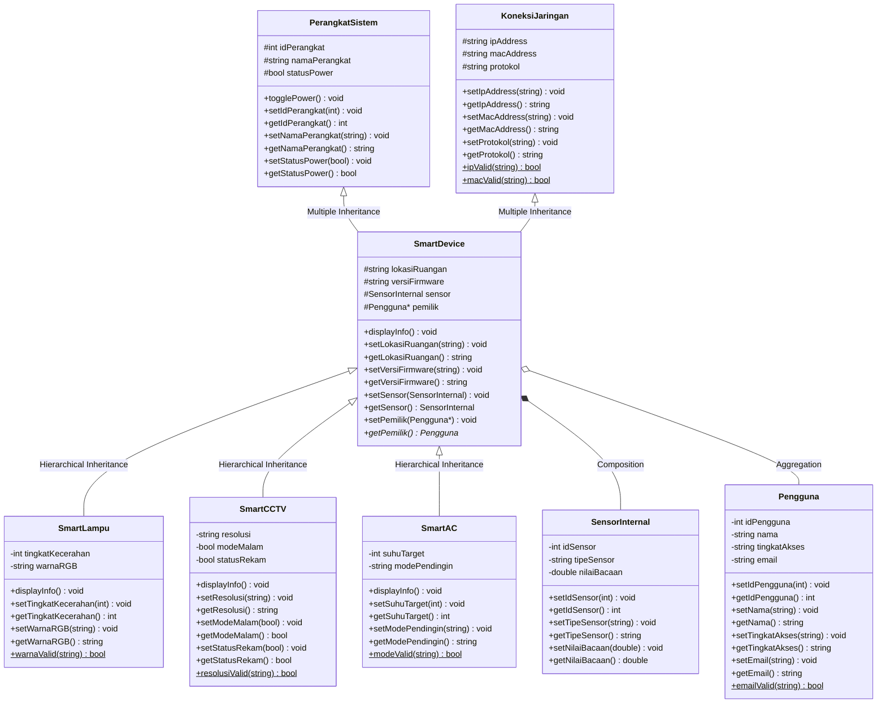

# Tugas Praktikum 3 - Desain Pemrograman Berorientasi Objek (TP3DPBO2526C2)

Saya Moch Fadillah Pratama dengan NIM 2506968 mengerjakan Tugas Praktikum 3 dalam mata kuliah Desain Pemrograman Berorientasi Objek untuk keberkahan-Nya maka saya tidak akan melakukan kecurangan seperti yang telah dispesifikasikan. Aamiin.

*Repository* ini berisi implementasi konsep OOP dalam 3 bahasa: **C++**, **Python**, dan **Java** (bonus) dengan tema **Sistem Smart Home / IoT**. Program mendemonstrasikan **Hybrid Inheritance**, **Composition**, **Aggregation**, dan **Array of Object**.

---

## Struktur Proyek

```
.
├── CPP/
│   ├── dokumentasi/
│   └── program/
│       ├── PerangkatSistem.cpp
│       ├── KoneksiJaringan.cpp
│       ├── SensorInternal.cpp
│       ├── Pengguna.cpp
│       ├── SmartDevice.cpp
│       ├── SmartLampu.cpp
│       ├── SmartCCTV.cpp
│       ├── SmartAC.cpp
│       └── main.cpp
├── JAVA/
│   ├── dokumentasi/
│   └── program/
│       ├── PerangkatSistem.java
│       ├── KoneksiJaringan.java
│       ├── SensorInternal.java
│       ├── Pengguna.java
│       ├── SmartDevice.java
│       ├── SmartLampu.java
│       ├── SmartCCTV.java
│       ├── SmartAC.java
│       └── Main.java
├── PYTHON/
│   ├── dokumentasi/
│   └── program/
│       ├── PerangkatSistem.py
│       ├── KoneksiJaringan.py
│       ├── SensorInternal.py
│       ├── Pengguna.py
│       ├── SmartDevice.py
│       ├── SmartLampu.py
│       ├── SmartCCTV.py
│       ├── SmartAC.py
│       └── main.py
└── README.md
```

## Cara Menjalankan

| Bahasa | Perintah (dari dalam foldernya) |
|---|---|
| C++ | `g++ main.cpp -o main` lalu `./main` |
| Python | `python main.py` |
| Java | `javac *.java` lalu `java Main` |

Program berjalan **interaktif** (menu bernomor).

---

## Diagram Kelas

Simbol: `-` private, `#` protected, `+` public.



---

## Penjelasan Atribut dan Method Setiap Kelas

Setiap atribut memiliki pasangan `setX()` dan `getX()`. Semua kelas memiliki constructor default dan constructor berparameter.

| Kelas | Peran | Atribut | Method utama (selain getter/setter) |
|---|---|---|---|
| `PerangkatSistem` | Base Class 1 | `# idPerangkat`, `# namaPerangkat`, `# statusPower` | `togglePower()` membalik status ON/OFF |
| `KoneksiJaringan` | Base Class 2 | `# ipAddress`, `# macAddress`, `# protokol` | - |
| `SensorInternal` | Member class (Composition) | `- idSensor`, `- tipeSensor`, `- nilaiBacaan` | - |
| `Pengguna` | Class (Aggregation) | `- idPengguna`, `- nama`, `- tingkatAkses`, `- email` | - |
| `SmartDevice` | Main class | `# lokasiRuangan`, `# versiFirmware`, `# sensor`, `# pemilik` | `displayInfo()` (virtual) menampilkan data gabungan |
| `SmartLampu` | Derived subclass | `- tingkatKecerahan`, `- warnaRGB` | `displayInfo()` (override) |
| `SmartCCTV` | Derived subclass | `- resolusi`, `- modeMalam`, `- statusRekam` | `displayInfo()` (override) |
| `SmartAC` | Derived subclass | `- suhuTarget`, `- modePendingin` (Cool, Dry, Fan, Eco) | `displayInfo()` (override) |

Method `...Valid()` bertanda `$` pada diagram adalah method **statis** untuk validasi format (IP, MAC, email, warna, resolusi, mode AC). Method ini dipakai oleh setter (untuk melempar error) dan oleh input di `main` (untuk meminta ulang).

---

## Penjelasan Desain Program

### 1. Multiple Inheritance
`SmartDevice` mewarisi dua kelas induk sekaligus: `PerangkatSistem` (identitas & daya) dan `KoneksiJaringan` (jaringan). Dengan begitu sebuah perangkat pintar otomatis punya data fisik **dan** data jaringan.

### 2. Hierarchical Inheritance
`SmartDevice` diturunkan menjadi tiga kelas anak yang sejajar: `SmartLampu`, `SmartCCTV`, dan `SmartAC`. Keduanya memakai semua atribut `SmartDevice` lalu menambahkan atribut khusus masing-masing (kecerahan & warna untuk lampu, resolusi & status rekam untuk CCTV, suhu target & mode pendingin untuk AC).

### 3. Hybrid Inheritance
Gabungan Multiple Inheritance (`PerangkatSistem` + `KoneksiJaringan` → `SmartDevice`) dan Hierarchical Inheritance (`SmartDevice` → `SmartLampu`, `SmartCCTV`, & `SmartAC`) membentuk pola **Hybrid Inheritance**.

### 4. Composition (`SmartDevice` ◆— `SensorInternal`)
Sensor adalah bagian yang tertanam dalam perangkat. Daur hidupnya terikat penuh pada `SmartDevice`: di C++ berupa objek langsung (anggota nilai), di Java dan Python berupa salinan yang dibuat dan dimiliki oleh `SmartDevice`. Jika perangkat dihapus, sensornya ikut hilang (di C++ terlihat jelas dari pesan destruktor).

### 5. Aggregation (`SmartDevice` ◇— `Pengguna`)
`SmartDevice` hanya menyimpan referensi (pointer di C++) ke `Pengguna`. Pengguna dibuat terpisah di `main`, sehingga ketika perangkat dihapus atau berganti pemilik, data pengguna tetap ada.

### 6. Array of Object & Polimorfisme
Semua perangkat disimpan dalam satu kumpulan bertipe `SmartDevice` (`vector<SmartDevice*>` di C++, `ArrayList<SmartDevice>` di Java, `list` di Python). Saat `displayInfo()` dipanggil, method yang berjalan adalah versi `SmartLampu`, `SmartCCTV`, atau `SmartAC` sesuai objek aslinya (lampu, CCTV, atau AC).

### Catatan perbedaan antarbahasa
* **C++**: multiple inheritance langsung (`class SmartDevice : public PerangkatSistem, public KoneksiJaringan`).
* **Python**: multiple inheritance langsung, konstruktor kedua induk dipanggil eksplisit. Visibilitas dengan konvensi `_` (protected) dan `__` (private).
* **Java**: tidak mendukung multiple inheritance antar-class. `PerangkatSistem` tetap berupa class (`extends`), sedangkan `KoneksiJaringan` dibuat **interface** yang diimplementasikan `SmartDevice` (atribut jaringan disimpan di `SmartDevice`).

---

## Fitur Interaktif (Data Statis & Dinamis)

Program memiliki dua tahap:

* **Tahap 1 - Data dummy (hardcode):** saat program mulai, 2 pengguna dan 3 perangkat (1 `SmartLampu`, 1 `SmartCCTV`, 1 `SmartAC`) dibuat langsung di kode, lalu dicetak sebagai kondisi **sebelum** penambahan.
* **Tahap 2 - Menu interaktif:** user memilih menu dengan **nomor**.

| No | Menu | Keterangan |
|---|---|---|
| 1 | Tambah perangkat - **STATIS** | Menambah paket 3 perangkat contoh (ID 102, 202, 302). Hanya bisa sekali karena ID akan duplikat. |
| 2 | Tambah perangkat - **DINAMIS** | Perangkat dibuat dari input user (jenis, ID, nama, jaringan, sensor, pemilik, dan atribut khusus jenis). |
| 3 | Tambah pengguna - **DINAMIS** | Pengguna baru dari input user, bisa dipilih sebagai pemilik perangkat (Aggregation). |
| 4 | Tampilkan semua perangkat | Polimorfisme: `displayInfo()` sesuai jenis objek. |
| 5 | Tampilkan semua pengguna | Daftar pengguna. |
| 6 | Ubah pengaturan perangkat | Toggle power, nilai sensor, pemilik, atau pengaturan khusus (kecerahan, warna, resolusi, rekam, suhu AC, mode AC). |
| 7 | Hapus perangkat | Demo Composition (sensor ikut hilang) vs Aggregation (pengguna tetap ada). |
| 0 | Keluar | Membersihkan memori lalu program selesai. |

Setiap penambahan perangkat (menu 1 dan 2) mencetak jumlah **sebelum** dan **sesudah**, lalu menampilkan seluruh data.

---

## Trigger & Error Handling

Setiap input yang salah **memicu (trigger)** pesan `[ERROR]` dan program **tidak crash**: user diminta mengulang atau kembali ke menu.

| Situasi | Contoh input | Penanganan |
|---|---|---|
| Seharusnya angka, diisi huruf/simbol/kosong | `abc` | Ditolak, minta ulang (`bacaInt` / `baca_int`) |
| Angka di luar rentang | menu `99`, suhu AC `35`, kecerahan `150` | Ditolak, minta ulang atau error dari setter |
| Angka terlalu besar (melebihi int 32-bit) | `99999999999` | Ditolak, minta ulang |
| ID duplikat / ID <= 0 | `101` (sudah ada), `-5` | Ditolak, minta ulang |
| Format IP / MAC / email / warna salah | `999.1.1.1`, `ZZ`, `andi`, `merah` | Ditolak oleh validasi format |
| Pilihan nomor tidak tersedia | pemilik nomor `5` padahal hanya 3 pengguna | Ditolak, minta ulang |
| Data statis ditambahkan dua kali | menu 1 dipilih lagi | Exception, aksi dibatalkan, kembali ke menu |
| Nilai tidak valid pada setter (kecerahan, suhu, warna, resolusi, mode AC, IP, MAC, email) | menu 6 lalu kecerahan `150` | Setter melempar exception (`invalid_argument` / `IllegalArgumentException` / `ValueError`) yang ditangkap di loop menu |
| Input berhenti mendadak (EOF / Ctrl+D) | - | Exception `InputSelesai`, program keluar dengan rapi |

Ada dua lapis pengaman: (1) fungsi input di `main` yang meminta ulang langsung, dan (2) validasi di dalam setter kelas yang melempar exception sehingga objek tidak pernah berisi data tidak valid.

---

## Alur Program

1. **Inisialisasi (Tahap 1):** data dummy hardcode dibuat (2 `Pengguna`, 3 perangkat), lalu dicetak sebagai kondisi awal.
2. **Menu interaktif (Tahap 2):** program menampilkan menu dan menunggu nomor pilihan. Input salah memicu error dan diminta ulang.
3. **Penambahan data:** user memilih data **statis** (menu 1) atau **dinamis** (menu 2 dan 3). Sebelum dan sesudah penambahan, jumlah data dicetak, lalu seluruh data ditampilkan.
4. **Perubahan data:** menu 6 mengubah data lewat setter. Nilai yang tidak valid memicu exception dan data lama tetap aman.
5. **Penghapusan:** menu 7 menghapus satu perangkat untuk menunjukkan Composition dan Aggregation.
6. **Terminasi:** user memilih `0` (atau input berakhir), memori dibersihkan, program selesai.

---

## Dokumentasi

Transkrip sesi lengkap (menggunakan `input_demo.txt`, termasuk contoh input salah) tersimpan di folder `dokumentasi` masing-masing (`output_cpp.txt`, `output_python.txt`, `output_java.txt`). Screenshot:

### C++
#### Sebelum INPUT

#### Setelah INPUT


### Python
#### Sebelum INPUT

#### Setelah INPUT


### Java
#### Sebelum INPUT

#### Setelah INPUT

