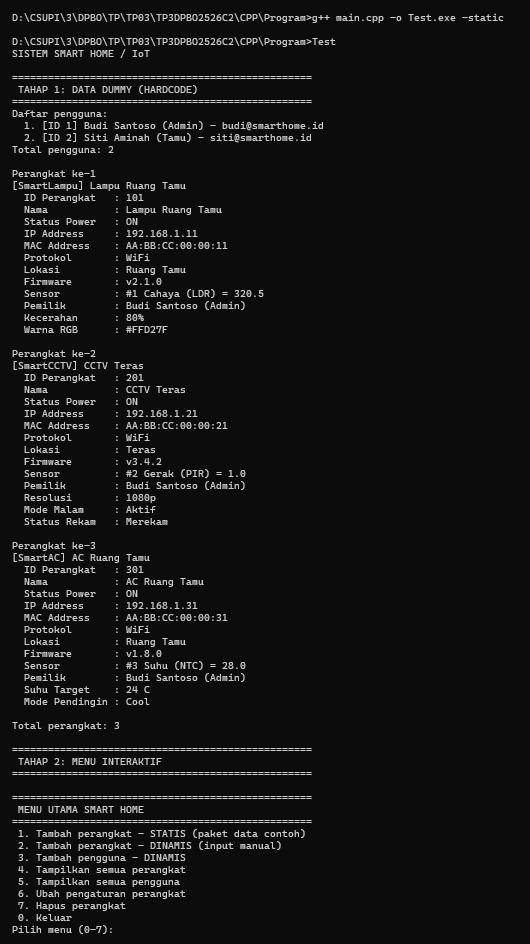
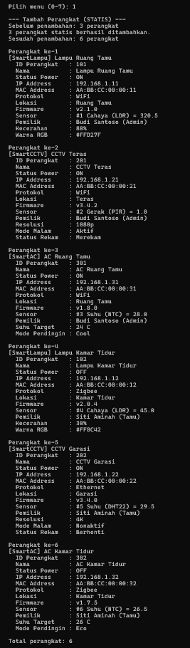
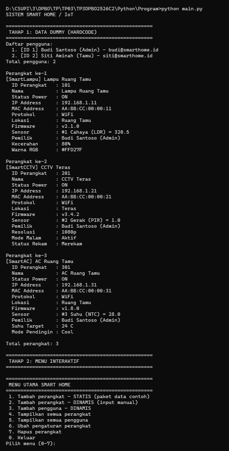
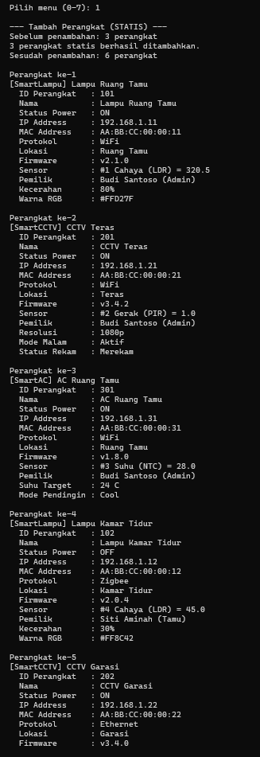
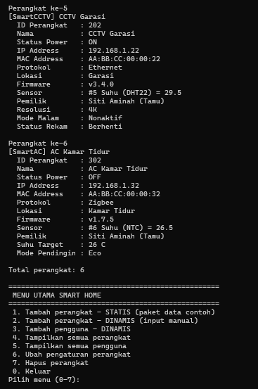
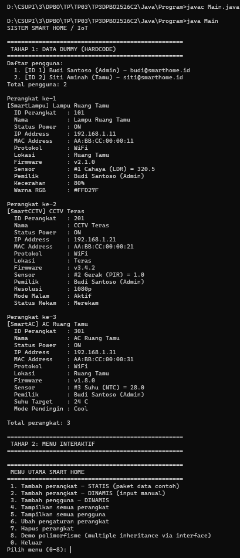
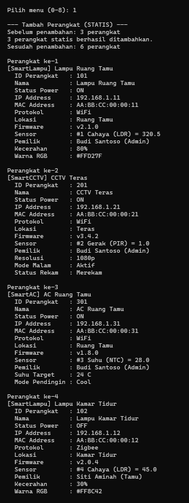
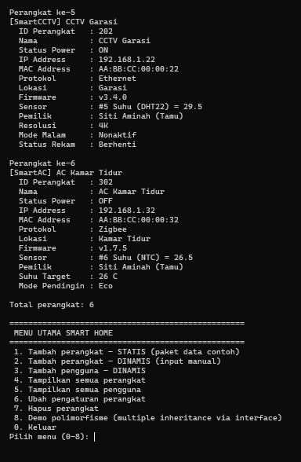
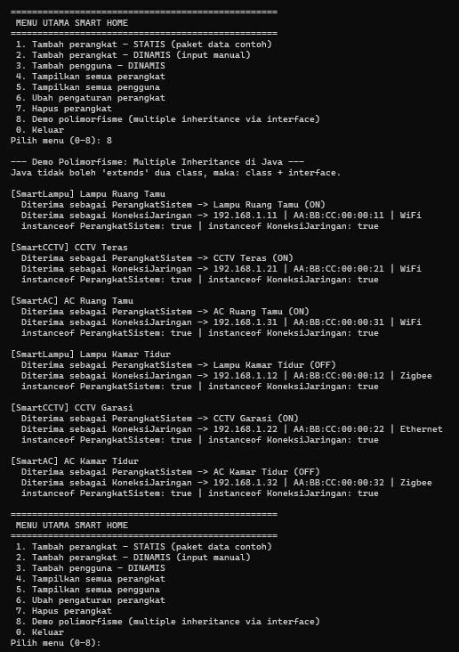

# Tugas Praktikum 3 - Desain Pemrograman Berorientasi Objek (TP3DPBO2526C2)

Saya Moch Fadillah Pratama dengan NIM 2506968 mengerjakan Tugas Praktikum 3 dalam mata kuliah Desain Pemrograman Berorientasi Objek untuk keberkahan-Nya maka saya tidak akan melakukan kecurangan seperti yang telah dispesifikasikan. Aamiin.

*Repository* ini berisi implementasi konsep OOP dalam 3 bahasa: **C++**, **Python**, dan **Java** (bonus) dengan tema **Sistem Smart Home / IoT**. Program mendemonstrasikan **Hybrid Inheritance**, **Composition**, **Aggregation**, dan **Array of Object**.

---

## Struktur Proyek

```
.
├── CPP/
│   ├── dokumentasi/
│   └── program/
│       ├── PerangkatSistem.cpp
│       ├── KoneksiJaringan.cpp
│       ├── SensorInternal.cpp
│       ├── Pengguna.cpp
│       ├── SmartDevice.cpp
│       ├── SmartLampu.cpp
│       ├── SmartCCTV.cpp
│       ├── SmartAC.cpp
│       └── main.cpp
├── JAVA/
│   ├── dokumentasi/
│   └── program/
│       ├── PerangkatSistem.java
│       ├── KoneksiJaringan.java    (interface)
│       ├── SensorInternal.java
│       ├── Pengguna.java
│       ├── SmartDevice.java
│       ├── SmartLampu.java
│       ├── SmartCCTV.java
│       ├── SmartAC.java
│       └── Main.java
├── PYTHON/
│   ├── dokumentasi/
│   └── program/
│       ├── PerangkatSistem.py
│       ├── KoneksiJaringan.py
│       ├── SensorInternal.py
│       ├── Pengguna.py
│       ├── SmartDevice.py
│       ├── SmartLampu.py
│       ├── SmartCCTV.py
│       ├── SmartAC.py
│       └── main.py
└── README.md
```

## Cara Menjalankan

| Bahasa | Perintah (dari dalam foldernya) |
|---|---|
| C++ | `g++ main.cpp -o main` lalu `./main` |
| Python | `python main.py` |
| Java | `javac *.java` lalu `java Main` |

Program berjalan **interaktif** (menu bernomor).

---

## Diagram Kelas

Simbol: `-` private, `#` protected, `+` public.


---

## Fungsi Atribut dan Method Setiap Kelas

Simbol visibilitas: `-` private, `#` protected, `+` public. Setiap atribut memiliki pasangan `setX()` dan `getX()`.
Pada Python protected ditulis `_nama` dan private `__nama`. Method `...Valid()` bertanda `$` pada diagram adalah method **statis** (dipanggil lewat nama kelas, tanpa membuat objek).

### 1. `PerangkatSistem` (Base Class 1)
Menyimpan identitas fisik dan status daya dasar yang dimiliki **semua** perangkat.

| Atribut | Tipe | Fungsi |
|---|---|---|
| `# idPerangkat` | int | Pengenal unik perangkat. Dipakai untuk mencari perangkat dan mencegah ID ganda. |
| `# namaPerangkat` | string | Nama yang mudah dibaca (contoh "Lampu Ruang Tamu") untuk identifikasi dan tampilan. |
| `# statusPower` | bool | Kondisi daya perangkat: `true` = ON, `false` = OFF. |

| Method | Fungsi |
|---|---|
| `PerangkatSistem()` | Constructor default: membuat objek dengan nilai awal kosong (ID 0, nama kosong, OFF). |
| `PerangkatSistem(id, nama, status)` | Constructor berparameter: mengisi ID, nama, dan status power sekaligus saat objek dibuat. |
| `togglePower()` | Membalik status daya (ON menjadi OFF, OFF menjadi ON). Diwarisi oleh semua perangkat. |
| `setIdPerangkat()` / `getIdPerangkat()` | Mengubah / membaca ID perangkat. |
| `setNamaPerangkat()` / `getNamaPerangkat()` | Mengubah / membaca nama perangkat. |
| `setStatusPower()` / `getStatusPower()` | Mengatur / membaca status power secara langsung. |

### 2. `KoneksiJaringan` (Base Class 2)
Menyimpan konfigurasi jaringan dan konektivitas IoT. (Di Java berbentuk **interface**, lihat bagian catatan Java.)

| Atribut | Tipe | Fungsi |
|---|---|---|
| `# ipAddress` | string | Alamat IP perangkat di jaringan lokal, dipakai sebagai alamat tujuan komunikasi. |
| `# macAddress` | string | Alamat fisik unik kartu jaringan perangkat, sebagai identitas perangkat di jaringan. |
| `# protokol` | string | Cara perangkat terhubung (WiFi, Zigbee, Ethernet, Bluetooth). |

| Method | Fungsi |
|---|---|
| `KoneksiJaringan()` | Constructor default: semua atribut jaringan kosong. |
| `KoneksiJaringan(ip, mac, protokol)` | Constructor berparameter: mengisi IP dan MAC lewat setter sehingga ikut divalidasi. |
| `setIpAddress()` / `getIpAddress()` | Mengubah IP (melempar error jika format salah) / membaca IP. |
| `setMacAddress()` / `getMacAddress()` | Mengubah MAC (melempar error jika format salah) / membaca MAC. |
| `setProtokol()` / `getProtokol()` | Mengubah / membaca protokol. |
| `ipValid(ip)` `$` | Memeriksa format IPv4: tepat 4 angka 0-255 dipisah titik. |
| `macValid(mac)` `$` | Memeriksa format MAC `XX:XX:XX:XX:XX:XX` (heksadesimal). |
| `ringkasanJaringan()` *(khusus Java, default method)* | Menggabungkan IP, MAC, dan protokol menjadi satu teks. Diwarisi otomatis oleh `SmartDevice`. |

### 3. `SensorInternal` (Member Class - Composition)
Modul sensor bawaan yang tertanam di dalam perangkat. Daur hidupnya terikat pada `SmartDevice`.

| Atribut | Tipe | Fungsi |
|---|---|---|
| `- idSensor` | int | Pengenal sensor (dibuat otomatis saat input dinamis). |
| `- tipeSensor` | string | Jenis sensor, misalnya Cahaya (LDR), Gerak (PIR), Suhu (NTC). |
| `- nilaiBacaan` | double | Hasil pengukuran terakhir sensor (lux, suhu, dan sebagainya). |

| Method | Fungsi |
|---|---|
| `SensorInternal()` | Constructor default: ID 0, tipe kosong, nilai 0. |
| `SensorInternal(id, tipe, nilai)` | Constructor berparameter: membuat sensor lengkap. |
| `setIdSensor()` / `getIdSensor()` | Mengubah / membaca ID sensor. |
| `setTipeSensor()` / `getTipeSensor()` | Mengubah / membaca tipe sensor. |
| `setNilaiBacaan()` / `getNilaiBacaan()` | Memperbarui / membaca nilai bacaan sensor. |

### 4. `Pengguna` (Class - Aggregation)
Data pemilik rumah yang mendaftarkan dan mengontrol perangkat. Daur hidupnya berdiri sendiri.

| Atribut | Tipe | Fungsi |
|---|---|---|
| `- idPengguna` | int | Pengenal unik pengguna, dicek agar tidak ganda. |
| `- nama` | string | Nama lengkap pengguna, ditampilkan sebagai pemilik perangkat. |
| `- tingkatAkses` | string | Hak akses pengguna: Admin, Anggota, atau Tamu. |
| `- email` | string | Alamat email kontak pengguna. |

| Method | Fungsi |
|---|---|
| `Pengguna()` | Constructor default: semua atribut kosong. |
| `Pengguna(id, nama, akses, email)` | Constructor berparameter: mengisi data pengguna, email divalidasi lewat setter. |
| `setIdPengguna()` / `getIdPengguna()` | Mengubah / membaca ID pengguna. |
| `setNama()` / `getNama()` | Mengubah / membaca nama. |
| `setTingkatAkses()` / `getTingkatAkses()` | Mengubah / membaca tingkat akses. |
| `setEmail()` / `getEmail()` | Mengubah email (error jika format salah) / membaca email. |
| `emailValid(email)` `$` | Memeriksa format email: ada `@` dan titik di bagian domain. |

### 5. `SmartDevice` (Main Class - Hybrid)
Kelas utama perangkat pintar. Menggabungkan identitas fisik (`PerangkatSistem`) dan jaringan (`KoneksiJaringan`), serta memiliki sensor dan pemilik.

| Atribut | Tipe | Fungsi |
|---|---|---|
| `# lokasiRuangan` | string | Ruangan tempat perangkat dipasang. |
| `# versiFirmware` | string | Versi perangkat lunak bawaan perangkat. |
| `# sensor` | SensorInternal | **Composition**: sensor milik perangkat sendiri. Jika perangkat dihapus, sensor ikut hilang. |
| `# pemilik` | Pengguna* / referensi | **Aggregation**: hanya menunjuk ke pengguna. Jika perangkat dihapus, data pengguna tetap ada. |

| Method | Fungsi |
|---|---|
| `SmartDevice()` | Constructor default: semua atribut kosong, belum ada pemilik. |
| `SmartDevice(id, nama, power, ip, mac, protokol, lokasi, firmware, sensor, pemilik)` | Constructor lengkap: memanggil constructor kedua induk, lalu mengisi lokasi, firmware, sensor (disalin), dan pemilik. |
| `~SmartDevice()` *(khusus C++)* | Destruktor virtual: dipanggil saat perangkat dihapus, mencetak bukti sensor ikut hancur. |
| `displayInfo()` | Menampilkan data umum: ID, nama, power, IP, MAC, protokol, lokasi, firmware, sensor, pemilik. Bersifat virtual agar bisa di-override anak. |
| `setLokasiRuangan()` / `getLokasiRuangan()` | Mengubah / membaca lokasi. |
| `setVersiFirmware()` / `getVersiFirmware()` | Mengubah / membaca versi firmware. |
| `setSensor()` / `getSensor()` | Mengganti sensor / mengambil sensor (berupa referensi sehingga nilainya bisa diubah langsung). |
| `setPemilik()` / `getPemilik()` | Mengganti pemilik / membaca pemilik. |
| `cetak(label, nilai)` *(khusus Java, protected static)* | Helper pencetak baris `label : nilai` yang dipakai semua `displayInfo()`. |

### 6. `SmartLampu` (Derived Subclass)
Perangkat lampu pintar yang dapat diatur terang dan warnanya.

| Atribut | Tipe | Fungsi |
|---|---|---|
| `- tingkatKecerahan` | int | Persentase terang lampu, rentang 0-100. |
| `- warnaRGB` | string | Warna cahaya dalam kode hex `#RRGGBB`. |

| Method | Fungsi |
|---|---|
| `SmartLampu(...)` | Constructor: memanggil `SmartDevice(...)` lalu mengisi kecerahan dan warna lewat setter (divalidasi). |
| `displayInfo()` *(override)* | Menampilkan data umum dari induk, lalu menambahkan kecerahan dan warna. |
| `setTingkatKecerahan()` / `getTingkatKecerahan()` | Mengatur kecerahan (error jika di luar 0-100) / membacanya. |
| `setWarnaRGB()` / `getWarnaRGB()` | Mengatur warna (error jika bukan `#RRGGBB`) / membacanya. |
| `warnaValid(warna)` `$` | Memeriksa format `#` diikuti 6 digit heksadesimal. |

### 7. `SmartCCTV` (Derived Subclass)
Kamera pengawas pintar.

| Atribut | Tipe | Fungsi |
|---|---|---|
| `- resolusi` | string | Kualitas gambar: 720p, 1080p, 2K, atau 4K. |
| `- modeMalam` | bool | Penglihatan malam: `true` = aktif. |
| `- statusRekam` | bool | Kondisi perekaman: `true` = sedang merekam. |

| Method | Fungsi |
|---|---|
| `SmartCCTV(...)` | Constructor: memanggil `SmartDevice(...)` lalu mengisi resolusi (divalidasi), mode malam, dan status rekam. |
| `displayInfo()` *(override)* | Menampilkan data umum dari induk, lalu resolusi, mode malam, dan status rekam. |
| `setResolusi()` / `getResolusi()` | Mengatur resolusi (error jika tidak didukung) / membacanya. |
| `setModeMalam()` / `getModeMalam()` | Menyalakan atau mematikan mode malam / membacanya. |
| `setStatusRekam()` / `getStatusRekam()` | Memulai atau menghentikan rekaman / membacanya. |
| `resolusiValid(r)` `$` | Memeriksa apakah resolusi termasuk yang didukung. |

### 8. `SmartAC` (Derived Subclass)
Pendingin ruangan pintar.

| Atribut | Tipe | Fungsi |
|---|---|---|
| `- suhuTarget` | int | Suhu yang diinginkan dalam derajat Celsius, rentang 16-30. |
| `- modePendingin` | string | Cara kerja AC: Cool, Dry, Fan, atau Eco. |

| Method | Fungsi |
|---|---|
| `SmartAC(...)` | Constructor: memanggil `SmartDevice(...)` lalu mengisi suhu dan mode lewat setter (divalidasi). |
| `displayInfo()` *(override)* | Menampilkan data umum dari induk, lalu suhu target dan mode pendingin. |
| `setSuhuTarget()` / `getSuhuTarget()` | Mengatur suhu (error jika di luar 16-30) / membacanya. |
| `setModePendingin()` / `getModePendingin()` | Mengatur mode (error jika bukan Cool/Dry/Fan/Eco) / membacanya. |
| `modeValid(mode)` `$` | Memeriksa apakah mode termasuk yang tersedia. |

### 9. Fungsi-fungsi pada `main`
Nama di Python memakai `snake_case` (misalnya `baca_int`), di C++ dan Java memakai `camelCase` (misalnya `bacaInt`).

| Fungsi | Kegunaan |
|---|---|
| `bacaBaris` | Membaca satu baris input; jika input habis (EOF) melempar `InputSelesai`. |
| `bacaInt` | Membaca bilangan bulat; menolak huruf, simbol, kosong, dan angka terlalu besar. |
| `bacaIntRentang` | Seperti `bacaInt` tetapi juga memastikan angka berada di rentang tertentu. |
| `bacaDouble` | Membaca bilangan desimal (titik atau koma). |
| `bacaTeks` | Membaca teks yang tidak boleh kosong. |
| `bacaIP`, `bacaMAC`, `bacaWarna`, `bacaEmail` | Membaca teks dengan validasi format masing-masing, mengulang sampai benar. |
| `pilihOpsi` | Menampilkan daftar pilihan bernomor dan mengembalikan pilihan user. |
| `cariIndexPerangkat`, `cariIndexPengguna` | Mencari data berdasarkan ID (untuk cek duplikat). |
| `tampilkanSemua`, `tampilkanPengguna` | Mencetak seluruh perangkat (polimorfisme `displayInfo()`) / seluruh pengguna. |
| `pilihPengguna`, `pilihPerangkat` | Memilih pemilik / perangkat dari daftar bernomor. |
| `isiDataDummy` | Mengisi data hardcode pada Tahap 1. |
| `tambahStatis`, `tambahDinamis`, `tambahPengguna` | Menambah data secara statis atau lewat input user. |
| `ubahPerangkat`, `hapusPerangkat` | Mengubah pengaturan lewat setter / menghapus perangkat (demo Composition vs Aggregation). |
| `demoPolimorfisme`, `cetakKoneksi`, `cetakPerangkat` *(khusus Java)* | Memperlihatkan satu objek `SmartDevice` diperlakukan sebagai `PerangkatSistem` dan `KoneksiJaringan`. |

---
## Penjelasan Desain Program

### 1. Multiple Inheritance
(Pada Java diwujudkan dengan class + interface, lihat catatan di bagian bawah.)
`SmartDevice` mewarisi dua kelas induk sekaligus: `PerangkatSistem` (identitas & daya) dan `KoneksiJaringan` (jaringan). Dengan begitu sebuah perangkat pintar otomatis punya data fisik **dan** data jaringan.

### 2. Hierarchical Inheritance
`SmartDevice` diturunkan menjadi tiga kelas anak yang sejajar: `SmartLampu`, `SmartCCTV`, dan `SmartAC`. Keduanya memakai semua atribut `SmartDevice` lalu menambahkan atribut khusus masing-masing (kecerahan & warna untuk lampu, resolusi & status rekam untuk CCTV, suhu target & mode pendingin untuk AC).

### 3. Hybrid Inheritance
Gabungan Multiple Inheritance (`PerangkatSistem` + `KoneksiJaringan` → `SmartDevice`) dan Hierarchical Inheritance (`SmartDevice` → `SmartLampu`, `SmartCCTV`, & `SmartAC`) membentuk pola **Hybrid Inheritance**.

### 4. Composition (`SmartDevice` ◆— `SensorInternal`)
Sensor adalah bagian yang tertanam dalam perangkat. Daur hidupnya terikat penuh pada `SmartDevice`: di C++ berupa objek langsung (anggota nilai), di Java dan Python berupa salinan yang dibuat dan dimiliki oleh `SmartDevice`. Jika perangkat dihapus, sensornya ikut hilang (di C++ terlihat jelas dari pesan destruktor).

### 5. Aggregation (`SmartDevice` ◇— `Pengguna`)
`SmartDevice` hanya menyimpan referensi (pointer di C++) ke `Pengguna`. Pengguna dibuat terpisah di `main`, sehingga ketika perangkat dihapus atau berganti pemilik, data pengguna tetap ada.

### 6. Array of Object & Polimorfisme
Semua perangkat disimpan dalam satu kumpulan bertipe `SmartDevice` (`vector<SmartDevice*>` di C++, `ArrayList<SmartDevice>` di Java, `list` di Python). Saat `displayInfo()` dipanggil, method yang berjalan adalah versi `SmartLampu`, `SmartCCTV`, atau `SmartAC` sesuai objek aslinya (lampu, CCTV, atau AC).

### Catatan perbedaan antarbahasa
* **C++**: multiple inheritance langsung (`class SmartDevice : public PerangkatSistem, public KoneksiJaringan`).
* **Python**: multiple inheritance langsung, constructor kedua induk dipanggil eksplisit. Visibilitas dengan konvensi `_` (protected) dan `__` (private).
* **Java**: lihat penjelasan di bawah.

#### Multiple Inheritance di Java: class + interface + polimorfisme
Java **tidak mengizinkan** sebuah class meng-`extends` dua class sekaligus. Cara standar Java untuk kebutuhan ini adalah memakai **interface**:

```java
public class SmartDevice extends PerangkatSistem implements KoneksiJaringan { ... }
```

* `PerangkatSistem` tetap berupa **class** (`extends`) karena menyimpan atribut dan `togglePower()`.
* `KoneksiJaringan` dijadikan **interface** (`implements`) yang berisi kontrak method jaringan, validasi statis (`ipValid`, `macValid`), dan satu *default method* `ringkasanJaringan()`.
* **Polimorfismenya**: satu objek `SmartDevice` dapat diperlakukan sebagai `PerangkatSistem` **dan** sebagai `KoneksiJaringan`. Contohnya method `cetakPerangkat(PerangkatSistem p)` dan `cetakKoneksi(KoneksiJaringan k)` sama-sama menerima objek `SmartLampu`, `SmartCCTV`, atau `SmartAC`. Hal ini bisa dicoba lewat **menu 8** (khusus Java).
* **Keterbatasan:** interface tidak bisa menyimpan atribut. Karena itu `ipAddress`, `macAddress`, dan `protokol` dideklarasikan di `SmartDevice`, bukan di `KoneksiJaringan` seperti pada C++ dan Python.

---

## Fitur Interaktif (Data Statis & Dinamis)

Program memiliki dua tahap:

* **Tahap 1 - Data dummy (hardcode):** saat program mulai, 2 pengguna dan 3 perangkat (1 `SmartLampu`, 1 `SmartCCTV`, 1 `SmartAC`) dibuat langsung di kode, lalu dicetak sebagai kondisi **sebelum** penambahan.
* **Tahap 2 - Menu interaktif:** user memilih menu dengan **nomor**.

| No | Menu | Keterangan |
|---|---|---|
| 1 | Tambah perangkat - **STATIS** | Menambah paket 3 perangkat contoh (ID 102, 202, 302). Hanya bisa sekali karena ID akan duplikat. |
| 2 | Tambah perangkat - **DINAMIS** | Perangkat dibuat dari input user (jenis, ID, nama, jaringan, sensor, pemilik, dan atribut khusus jenis). |
| 3 | Tambah pengguna - **DINAMIS** | Pengguna baru dari input user, bisa dipilih sebagai pemilik perangkat (Aggregation). |
| 4 | Tampilkan semua perangkat | Polimorfisme: `displayInfo()` sesuai jenis objek. |
| 5 | Tampilkan semua pengguna | Daftar pengguna. |
| 6 | Ubah pengaturan perangkat | Toggle power, nilai sensor, pemilik, atau pengaturan khusus (kecerahan, warna, resolusi, rekam, suhu AC, mode AC). |
| 7 | Hapus perangkat | Demo Composition (sensor ikut hilang) vs Aggregation (pengguna tetap ada). |
| 8 | Demo polimorfisme *(khusus Java)* | Menunjukkan `SmartDevice` diperlakukan sebagai `PerangkatSistem` dan `KoneksiJaringan`. |
| 0 | Keluar | Membersihkan memori lalu program selesai. |

Setiap penambahan perangkat (menu 1 dan 2) mencetak jumlah **sebelum** dan **sesudah**, lalu menampilkan seluruh data.

---
## Trigger & Error Handling

Setiap input yang salah **memicu (trigger)** pesan `[ERROR]` dan program **tidak crash**: user diminta mengulang atau kembali ke menu.

| Situasi | Contoh input | Penanganan |
|---|---|---|
| Seharusnya angka, diisi huruf/simbol/kosong | `abc` | Ditolak, minta ulang (`bacaInt` / `baca_int`) |
| Angka di luar rentang | menu `99`, suhu AC `35`, kecerahan `150` | Ditolak, minta ulang atau error dari setter |
| Angka terlalu besar (melebihi int 32-bit) | `99999999999` | Ditolak, minta ulang |
| ID duplikat / ID <= 0 | `101` (sudah ada), `-5` | Ditolak, minta ulang |
| Format IP / MAC / email / warna salah | `999.1.1.1`, `ZZ`, `andi`, `merah` | Ditolak oleh validasi format |
| Pilihan nomor tidak tersedia | pemilik nomor `5` padahal hanya 3 pengguna | Ditolak, minta ulang |
| Data statis ditambahkan dua kali | menu 1 dipilih lagi | Exception, aksi dibatalkan, kembali ke menu |
| Nilai tidak valid pada setter (kecerahan, suhu, warna, resolusi, mode AC, IP, MAC, email) | menu 6 lalu kecerahan `150` | Setter melempar exception (`invalid_argument` / `IllegalArgumentException` / `ValueError`) yang ditangkap di loop menu |
| Input berhenti mendadak (EOF / Ctrl+D) | - | Exception `InputSelesai`, program keluar dengan rapi |

Ada dua lapis pengaman: (1) fungsi input di `main` yang meminta ulang langsung, dan (2) validasi di dalam setter kelas yang melempar exception sehingga objek tidak pernah berisi data tidak valid.

---

## Alur Program

1. **Inisialisasi (Tahap 1):** data dummy hardcode dibuat (2 `Pengguna`, 3 perangkat), lalu dicetak sebagai kondisi awal.
2. **Menu interaktif (Tahap 2):** program menampilkan menu dan menunggu nomor pilihan. Input salah memicu error dan diminta ulang.
3. **Penambahan data:** user memilih data **statis** (menu 1) atau **dinamis** (menu 2 dan 3). Sebelum dan sesudah penambahan, jumlah data dicetak, lalu seluruh data ditampilkan.
4. **Perubahan data:** menu 6 mengubah data lewat setter. Nilai yang tidak valid memicu exception dan data lama tetap aman.
5. **Penghapusan:** menu 7 menghapus satu perangkat untuk menunjukkan Composition dan Aggregation.
6. **Terminasi:** user memilih `0` (atau input berakhir), memori dibersihkan, program selesai.

---

## Dokumentasi
### C++
#### Sebelum INPUT

#### Setelah INPUT


### Python
#### Sebelum INPUT

#### Setelah INPUT



### Java
#### Sebelum INPUT

#### Setelah INPUT


#### Demo Polimorfisme

